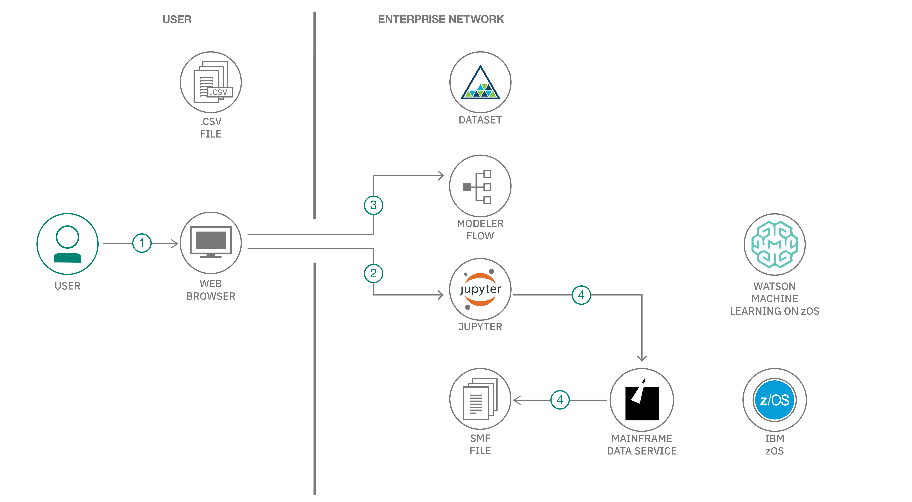

<!-- Put badges at the very top -->
<!-- Change the repo -->

<!-- Add a new Title and fill in the blanks -->

# Batch Job Analytics via Watson Machine Learning on zOS

Running batch job is critical operation on mainframe. Everyday there are 10000~60000 jobs running at day and night. During begin or end day of month/quarter/year, the workload may reach twice of regular days.

Machine learning analytics on large volume logs of batch job could help administrators in 4 aspects:

* Understand batch job seasonality and workload change trend
* Gain insight of important impact for batch job elapsed time
* Predict elapsed time of long time batch jobs
* Identify candidate of abnormal batch job instances

In this code pattern, we will show some analytics samples to BankABC's Master Batch Job by using python notebook and modeler flow, based on customized sample data, validated workable on IBM Watson Machine Learning on zOS.
   
   > BankABC wants to analyze elapsed time of Master Batch Job(MBJ). MBJ is a big application run at every midnight, includes over 10000 jobs, covered various types of business transaction.  
   BankABC hopes to know how MBJ elapsed time changes, which factors impact it mostly, what is the correlation among daily business transaction volumes and elapsed time.  
   Additionally, BankABC want to know if MBJ elapsed time is predictable. Usually MBJ will run 2~5 hours at midnight, BankABC want to make sure it complete before office hour in next morning. A reasonable predition will help to arrange MBJ and maintenance jobs productively, and useful for anomaly detection.  

When you have completed this code pattern, you will understand how to:

* Extract batch job log data from SMF type 30 file in mainframe
* Explore log data to get insight about batch job elapsed time 
* Use several algorithms to predict batch job elapsed time 
* Identify candidates of abnormal batch job instances and business transaction volume

   
## Architecture

<!--add an image in this path-->

### Highlights
1. You could work on WMLz(IBM Watson Machine Learning for zOS) through web browser.
2. WMLz provides Jupyter Notebook for you to code in Python, SCALA and R.
3. WMLz provides Modeler Flow for you to explore data and train model in canvas by drop and down.
4. You could read z native file eg SMF Type 30 file with Python notebook based on included mainframe data service.

## What is included ?
   **There are 5 important folders in the Github project**
   
   ### Data
    1. df_smf.csv
       Sample output of 1_BatchJob_SMF30Extract.ipynb, which is batch job run time metrics, the most important data input for later batch job analytics.
       In zOS operation log, SMF provides a common interface to extract system operation measurements. SMF Type 30 includes records of batch job operation. 
       In real client environments, such data could be also collected by other 3rd party softwares.

    2. MasterBatchJob.csv
       Elapsed time of MBJ in one year, sample data simulated for demo.

    3. TxnVolume.csv
       Transaction Volumns of various business type one year, sample data simulated for demo.   

    4. calendar_join.csv
       Calendar data with calenday elements like weekday, day, month and etc.

    5. widetable_MBJ.csv
       A joined wide table of MBJ elapsed time, transaction volumes and calendar data, ready for model training for 3_BatchJob_MBJ_Prediction.ipynb.
    

   
   ### Notebook 
    It includes source code of 4 Python notebooks and 2 Modeler flows. You could read and run them one by one following the instruction.

   
    * 0_readme.ipynb

      Overview of this sample.

    * 1_BatchJob_SMF30Extract.ipynb

      It extract batch job run time operation data from SMF Type 30 logfile. 

      You could refer to IBM Knowledge Center about SMF Type 30, to get know more about mainframe job metrics definition according to your zOS version.

      Since SMF 30 log file is usually large in size, so not included in the project package, but a sample output from this Notebook df_smf.csv is included for your information.

    * 2_BatchJob_MBJ_DataExploration.ipynb

      This notebook explores MBJ's elpased time, get insight on trend in timeline, correlation to daytime business volumes, periodicity on week/day/month.

    * 3_BatchJob_MBJ_Prediction.ipynb

      This notebook applies 3 methods to predict MBJ elapsed time based on historical data, calendar information and business transaction volume data, emsenble them as final results.

    _Note:

        In notebook cell, when read local dataset on Waston Machine Learning for zOS, will need a token for authetication, the expiration period is configurated by adminitrator, when you run cell failed and error message shows that token expired, please click on top right button to get a new up-to-date token to replace the old project context._ 
 
  
  ###Flow
    It includes 2 flows.
    * 4_BatchJob_MBJ_TSPredict.str
      This flow applies time series algorithm to predict elapsed time.
      
    * 5_BatchJob_MBJ_AnomalyDetect.str
      This flow detects anomaly in elapsed time and business transaction volumes.
      

  ### ProjectZIP

    2 zip files with same content, BatchJobAnalytics.zip and BatchJobAnalytics.tar.gz, used for Windows/Mac and linux respecitive.

    In web browser with IBM Waston Machine Learning for zOS, you could "Add Project" from file with the zip file. It will add a new project with previous python notebooks and all datasets at one time. And then you could enjoy to explore the sample project as you like.

  
  ### View

    Before you run and explore the demo process of analytics, you could find the demo output here, easy and straight forward.  
    4 readonly view of html files, with output result of python notebooks are included.
    2 screenshot from flow output, with predicted result and abnormal records detected.

## Steps to import this project to WMLz

1. Download .zip (for Windows or Mac) or .tar.gz (for Linux) file in folder of "ProjectZIP" to your computer
2. Login to WMLz in your enterprise WMLz URL, with your username and password.
3. Select "Projects" in left menu pellete, click on "Create New Project"
4. Select tab of "Add from file", browse in your computer and select the file you downloaded in step 1, click "OK"
5. Check the added new project, it should includes 4 notebooks,2 flows and 5 datasets.

<!-- keep this -->
## License

This code pattern is licensed under the Apache License, Version 2. Separate third-party code objects invoked within this code pattern are licensed by their respective providers pursuant to their own separate licenses. Contributions are subject to the [Developer Certificate of Origin, Version 1.1](https://developercertificate.org/) and the [Apache License, Version 2](https://www.apache.org/licenses/LICENSE-2.0.txt).

[Apache License FAQ](https://www.apache.org/foundation/license-faq.html#WhatDoesItMEAN)

